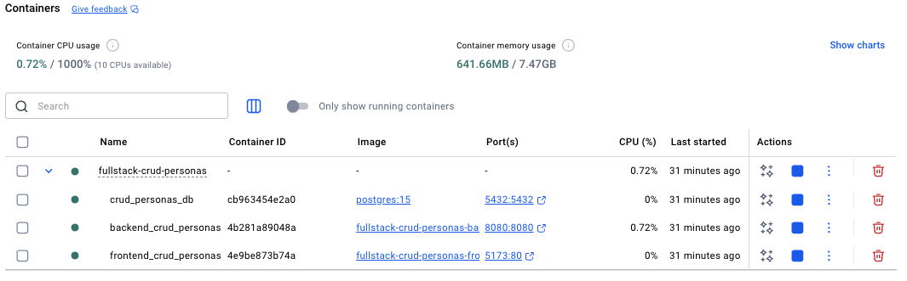
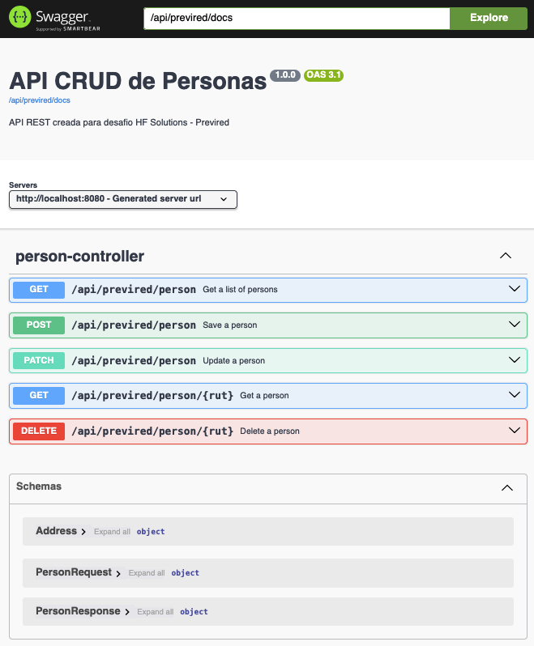

# 📝 CRUD Personas - fullstack demo project

## 🔹 Acerca de este proyecto

Desarrollado como desafio para proceso de postulacion para empresa HF Solutions - Previred. El proyecto consta de dos repositorios:

- https://github.com/hcarrasc/backend-crud-personas
- https://github.com/hcarrasc/frontend-crud-personas

Cada repositorio tiene las indicaciones para levantarlos por separado. Adicionalmente se incluye este repositorio el cual permite levantar el proyecto completo en un solo contenedor de docker usando docker-compose

## 🔹 Pre-requisitos

Antes de levantar el proyecto, asegúrate de que tu máquina tenga:

1. **Docker Desktop** instalado y corriendo
   - [https://www.docker.com/products/docker-desktop](https://www.docker.com/products/docker-desktop)
   - Versiones recientes incluyen Docker CLI y Docker Compose integrado.
2. Terminal en macOS/Linux o PowerShell/WSL en Windows.
3. Puerto `8080`, `5432`, `5173` libres para el backend, la base de datos y la aplicacion de frontend

## 🔹 Consideraciones

- El proyecto usa **Docker Compose** para levantar dos servicios:
  1. `db` → PostgreSQL con persistencia de datos.
  2. `backend` → API desarrollada con spring boot para CRUD Personas.
  3. `frontend` → Formulario simple de frontend para CRUD Personas.
- Las variables de conexión a la base y CORS están definidas en `docker-compose.yml`.
- La primera vez que se levanta el proyecto, Docker descargará las imágenes y construirá la app, lo que puede tardar unos minutos.

## 🔹 Ejecutar el proyecto

### 1. Levantar el proyecto (construyendo imágenes)

Ejecuta este comando en la raiz del proyecto, construye la app y la base de datos, mostrando logs en tiempo real

```bash
docker compose up --build
```

### 2. Detener el proyecto

```bash
docker compose down
```

## 🔹 Acceso a la aplicación

- Aplicación frontend:
  http://localhost:5173/
- API base:
  http://localhost:8080/api/previred/person
- URL de documentacion Swagger:
  http://localhost:8080/api/previred/docs

## 🔹 Stack tecnológico

### Backend (Spring Boot)

- Lenguaje: Java 21
- Framework: Spring Boot 3.5
- Persistencia: Spring Data JPA + Hibernate
- Base de datos: PostgreSQL 15
- Validación: Jakarta Bean Validation
- Gestión de dependencias: Maven
- Documentación de API: OpenAPI / Swagger (springdoc-openapi)

### Frontend (React)

- Framework: React 18+
- Lenguaje: TypeScript
- Estilos: Tailwind CSS 3
- Gestión de dependencias: npm
- Build tool: Vite
- Despliegue: Servido por Nginx en Docker

## 🔹 Resultado esperado si levantas la aplicacion




